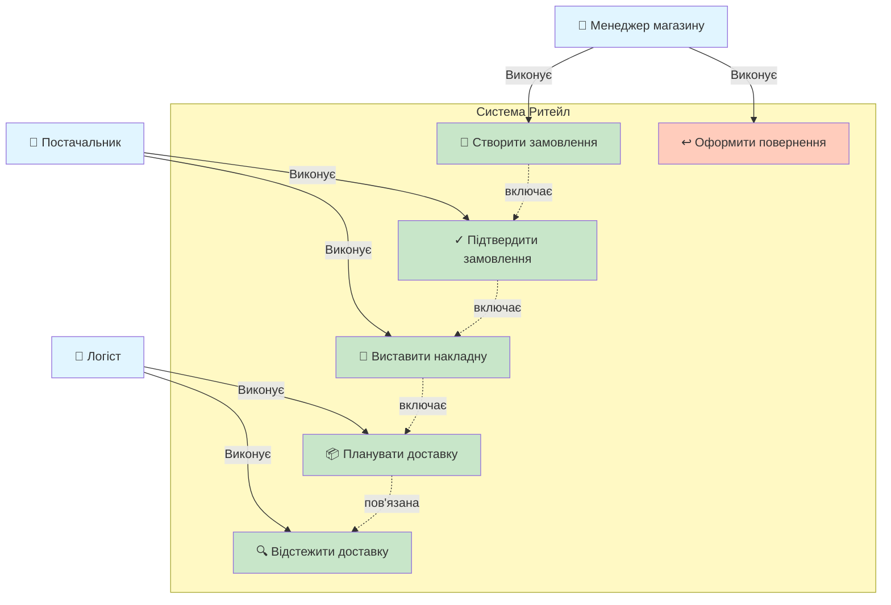
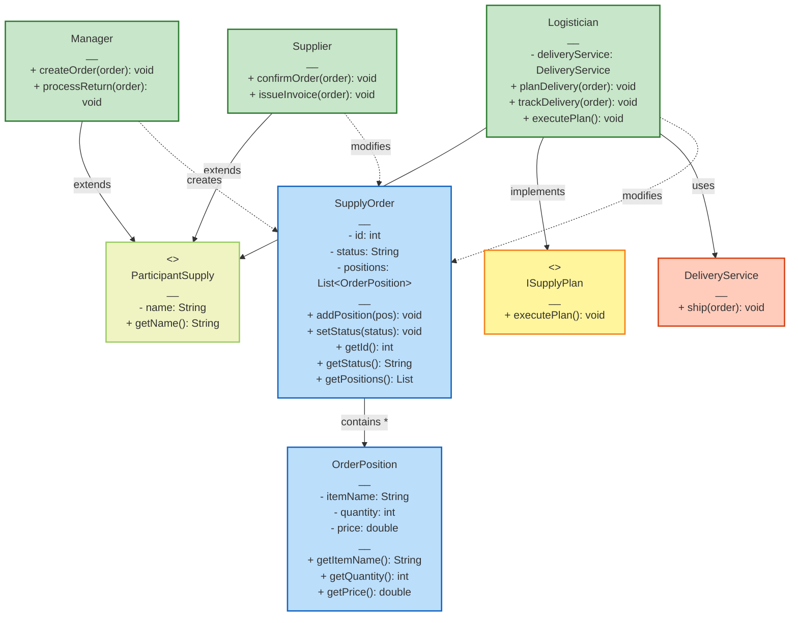
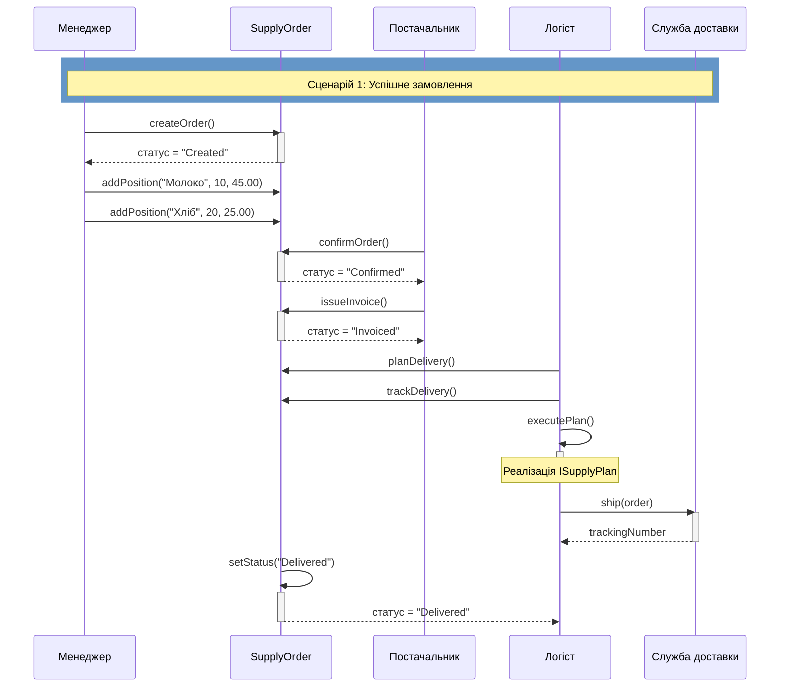
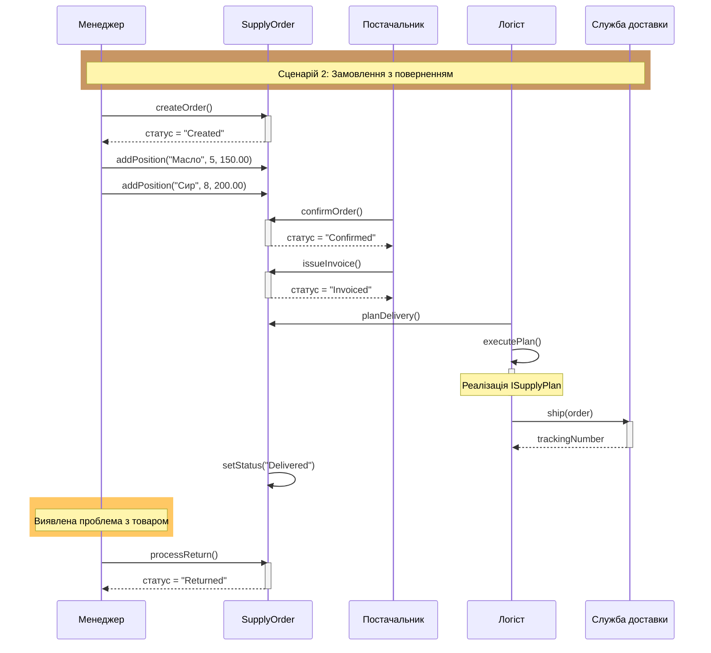
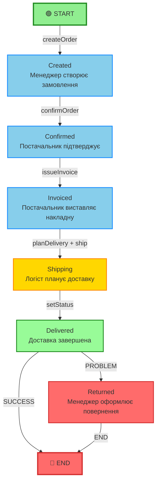

# 🎨 Mermaid діаграми - Швидкий перегляд

> Цей файл містить всі Mermaid діаграми в одному місці для швидкого перегляду та порівняння

---

## 1️⃣ Use Case Diagram

**Файл:** [diagrams/usecase-mermaid.md](diagrams/usecase-mermaid.md)



---

## 2️⃣ Class Diagram

**Файл:** [diagrams/class-mermaid.md](diagrams/class-mermaid.md)



---

## 3️⃣ Sequence Diagram - Сценарій 1 (Успішне замовлення)

**Файл:** [diagrams/sequence-scenario1-mermaid.md](diagrams/sequence-scenario1-mermaid.md)



---

## 4️⃣ Sequence Diagram - Сценарій 2 (Замовлення з поверненням)

**Файл:** [diagrams/sequence-scenario2-mermaid.md](diagrams/sequence-scenario2-mermaid.md)



---

## 5️⃣ State Diagram

**Файл:** [diagrams/state-mermaid.md](diagrams/state-mermaid.md)



---

## 📊 Порівняння з PlantUML

### Таблиця еквівалентності

| PlantUML | Mermaid | Статус |
|----------|---------|--------|
| [docs/usecase.puml](docs/usecase.puml) | [diagrams/usecase-mermaid.md](diagrams/usecase-mermaid.md) | ✓ 100% еквівалент |
| [docs/class.puml](docs/class.puml) | [diagrams/class-mermaid.md](diagrams/class-mermaid.md) | ✓ 95% еквівалент + доповнення |
| [docs/sequence.puml](docs/sequence.puml) | [diagrams/sequence-scenario1-mermaid.md](diagrams/sequence-scenario1-mermaid.md) | ⚠️ 90% + більше деталей |
| N/A | [diagrams/sequence-scenario2-mermaid.md](diagrams/sequence-scenario2-mermaid.md) | ✓ НОВИЙ: Сценарій 2 |
| [docs/state.puml](docs/state.puml) | [diagrams/state-mermaid.md](diagrams/state-mermaid.md) | ✓ 100% еквівалент |

---

## 🔍 Ключові покращення Mermaid версій

### 1. **Use Case Diagram**
- ✓ Додано візуальні іконки (👤, 📝, ✓, 📄, 📦, 🔍, ↩️)
- ✓ Кольорове кодування
- ✓ Чіткіша читаність

### 2. **Class Diagram**
- ✓ Додано явно атрибут `deliveryService` в Logistician
- ✓ Додано явно методи-гетери в SupplyOrder та OrderPosition
- ✓ Кольорове розрізнення типів класів
- ✓ Чіткіше позначення залежностей

### 3. **Sequence Diagram - Сценарій 1**
- ✓ Додано явно виклики `addPosition()`
- ✓ Додано явно виклик `trackDelivery()`
- ✓ Додано явно виклик `executePlan()`
- ✓ Кольорові прямокутники для різних фаз
- ✓ Видно активацію об'єктів

### 4. **Sequence Diagram - Сценарій 2**
- ✓ **НОВИЙ:** Повна діаграма для сценарію з поверненням
- ✓ Показує альтернативний шлях обробки
- ✓ Демонструє решення з процесом повернення

### 5. **State Diagram**
- ✓ Додано кольорові акценти для різних типів переходів
- ✓ Розгалуження представлено з параметрами (SUCCESS/PROBLEM)
- ✓ Чітке розрізнення початку та кінця
- ✓ Явні імена переходів

---

## 💡 Рекомендації щодо використання

### Для GitHub README
Рекомендується вбудовувати Mermaid діаграми прямо у README.md через GitHub's native підтримку:

```markdown
## Architecture

### Use Case Diagram
[вбудована діаграма]

### Class Diagram
[вбудована діаграма]

### Workflows
[Sequence діаграми]

### Order State Machine
[State діаграма]
```

### Для локального перегляду
1. Використовуйте GitHub щоб переглянути Mermaid
2. Або встановіть Mermaid Live Editor: https://mermaid.live

### Для документації
Розглянути додавання обох версій (PlantUML + Mermaid) для:
- PlantUML - формальна документація
- Mermaid - GitHub-friendly версія

---

## 📚 Посилання

| Діаграма | PlantUML | Mermaid |
|----------|----------|---------|
| Use Case | [docs/usecase.puml](docs/usecase.puml) | [diagrams/usecase-mermaid.md](diagrams/usecase-mermaid.md) |
| Class | [docs/class.puml](docs/class.puml) | [diagrams/class-mermaid.md](diagrams/class-mermaid.md) |
| Sequence | [docs/sequence.puml](docs/sequence.puml) | [diagrams/sequence-scenario1-mermaid.md](diagrams/sequence-scenario1-mermaid.md) |
| State | [docs/state.puml](docs/state.puml) | [diagrams/state-mermaid.md](diagrams/state-mermaid.md) |
| Scenario 2 | N/A | [diagrams/sequence-scenario2-mermaid.md](diagrams/sequence-scenario2-mermaid.md) |

---

**Дата створення:** 6 грудня 2025
**Статус:** ✅ Готово
**Кількість діаграм:** 5 Mermaid + 4 PlantUML = 9 всього
