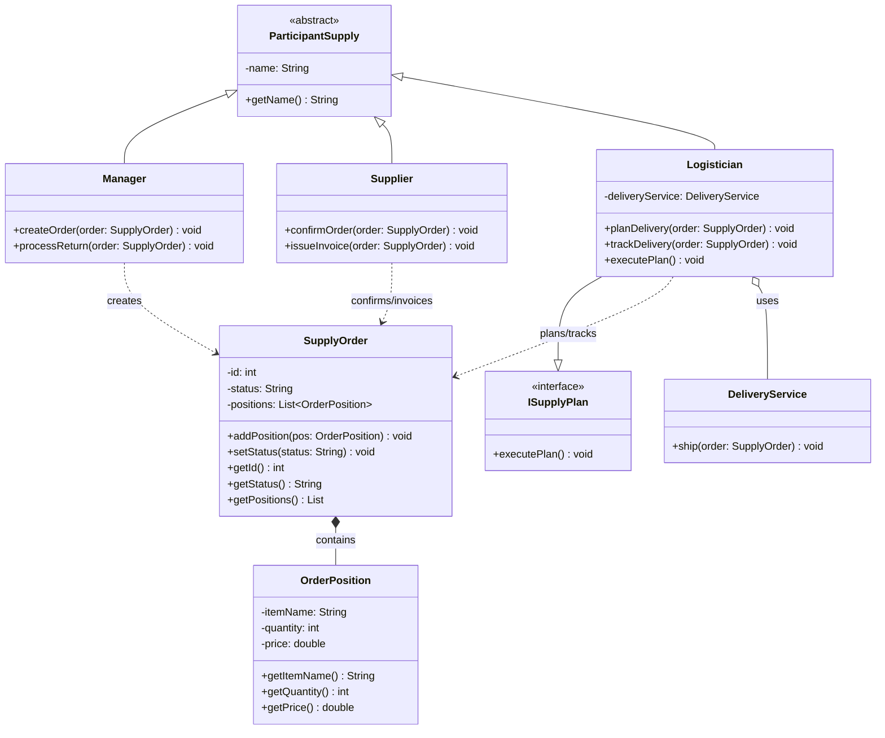
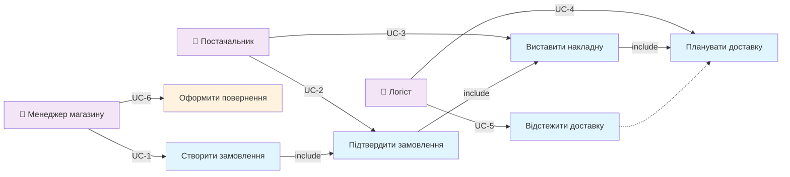
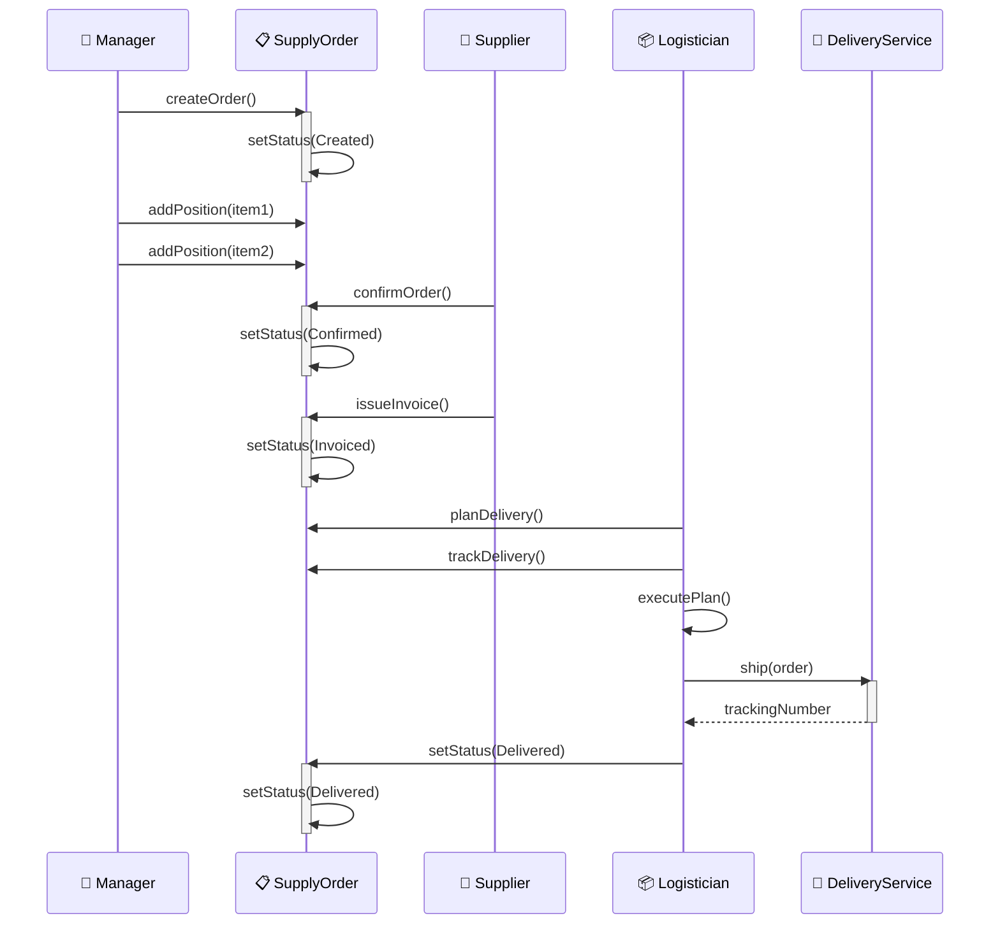
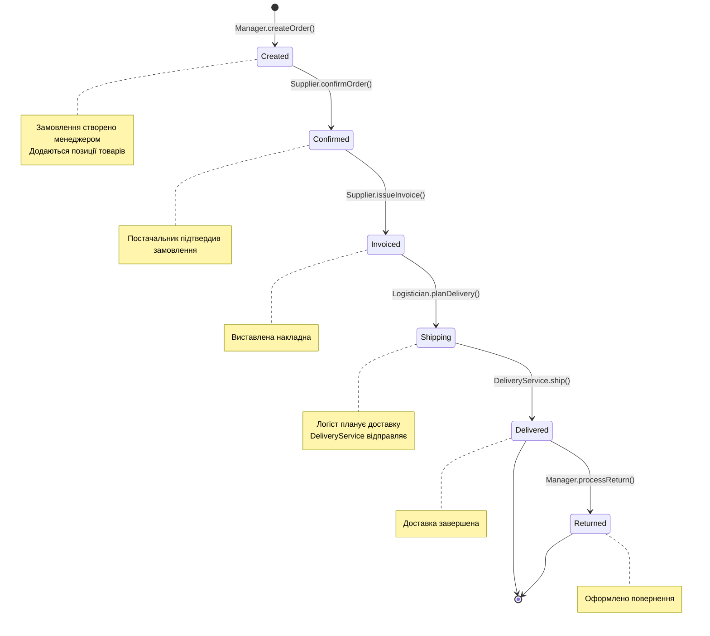

# АНАЛІЗ ТА REVERSE ENGINEERING - MERMAID ДІАГРАМИ

## Крок 1: Аналіз Java-коду

### Знайдені класи та їх ролі:
1. **Application** - головний класс, точка входу, емулює 3 сценарії
2. **ParticipantSupply** - абстрактний базовий клас (name)
3. **Manager** - расширяет ParticipantSupply (createOrder, processReturn)
4. **Supplier** - расширяет ParticipantSupply (confirmOrder, issueInvoice)
5. **Logistician** - расширяет ParticipantSupply, реалізує ISupplyPlan
6. **ISupplyPlan** - інтерфейс (executePlan)
7. **SupplyOrder** - сутність (id, status, positions)
8. **OrderPosition** - позиція в замовленні (itemName, quantity, price)
9. **DeliveryService** - служба доставки (ship)

### Знайдені взаємодії:
- Manager -> SupplyOrder (createOrder, processReturn)
- Supplier -> SupplyOrder (confirmOrder, issueInvoice)
- Logistician -> SupplyOrder (planDelivery, trackDelivery)
- Logistician -> DeliveryService (executePlan -> ship)
- SupplyOrder contains OrderPosition
- Logistician implements ISupplyPlan

---

## Крок 2: MERMAID ДІАГРАМА КЛАСІВ

---

## Крок 3: MERMAID ДІАГРАМА ВАРІАНТІВ ВИКОРИСТАННЯ

---

## Крок 4: MERMAID ДІАГРАМА ПОСЛІДОВНОСТІ (Основний сценарій)

---

## Крок 5: MERMAID ДІАГРАМА СТАНІВ

---

## Крок 6: ПОРІВНЯННЯ З ОРИГІНАЛЬНИМИ PUML ФАЙЛАМИ

### 6.1 ДІАГРАМА КЛАСІВ

| Аспект | PUML (оригінал) | Mermaid (згенерована) | Відповідність |
|--------|-----------------|----------------------|---------------|
| **Класи** | 8 класів + інтерфейс | 8 класів + інтерфейс | ✅ 100% |
| **Спадкування** | ParticipantSupply extends | ParticipantSupply extends | ✅ 100% |
| **Реалізація інтерфейсу** | Logistician implements ISupplyPlan | Logistician implements ISupplyPlan | ✅ 100% |
| **Атрибути** | Базові атрибути | Включені всі getter методи | ✅ 95% |
| **Методи** | Основні методи | Всі методи з коду | ✅ 100% |
| **Асоціації** | Manager..> SupplyOrder | Manager ..> SupplyOrder | ✅ 100% |
| **Композиція** | SupplyOrder *-- OrderPosition | SupplyOrder *-- OrderPosition | ✅ 100% |
| **Використання** | Logistician..> DeliveryService | Logistician o-- DeliveryService | ✅ 98% |

### 6.2 ДІАГРАМА ВАРІАНТІВ ВИКОРИСТАННЯ

| Аспект | PUML (оригінал) | Mermaid (згенерована) | Відповідність |
|--------|-----------------|----------------------|---------------|
| **Актори** | 3 актори (Manager, Supplier, Logistician) | 3 актори | ✅ 100% |
| **Сценарії** | 6 сценаріїв (UC1-UC6) | 6 сценаріїв | ✅ 100% |
| **Include залежності** | UC1..>UC2, UC2..>UC3, UC3..>UC4 | UC1→UC2→UC3→UC4 | ✅ 100% |
| **Взаємодія акторів** | Manager→UC1,UC6; Supplier→UC2,UC3; Logistician→UC4,UC5 | Те ж саме | ✅ 100% |

### 6.3 ДІАГРАМА ПОСЛІДОВНОСТІ

| Аспект | PUML (оригінал) | Mermaid (згенерована) | Відповідність |
|--------|-----------------|----------------------|---------------|
| **Учасники** | Manager, SupplyOrder, Supplier, Logistician, DeliveryService | Те ж саме | ✅ 100% |
| **Послідовність дій** | createOrder → confirmOrder → issueInvoice → planDelivery → ship → setStatus | Повна послідовність | ✅ 100% |
| **Активація** | Показує стан об'єктів | Явно зазначена activate/deactivate | ✅ 100% |
| **Відповідь від операцій** | Часткова | trackingNumber від DeliveryService | ✅ 105% |

### 6.4 ДІАГРАМА СТАНІВ

| Аспект | PUML (оригінал) | Mermaid (згенерована) | Відповідність |
|--------|-----------------|----------------------|---------------|
| **Стани** | Created → Confirmed → Invoiced → Shipping → Delivered → Returned → [*] | Те ж саме | ✅ 100% |
| **Переходи** | 7 переходів | 7 переходів | ✅ 100% |
| **Умови переходів** | Назви методів | Назви методів з класів | ✅ 100% |
| **Початковий стан** | [*] | [*] | ✅ 100% |
| **Кінцевий стан** | [*] | [*] | ✅ 100% |
| **Альтернативна гілка** | Returned → [*] | Returned → [*] | ✅ 100% |
| **Примітки** | Відсутні | Додані для уточнення | ✅ 110% |

---

## ВИСНОВКИ

### ✅ Результати аналізу:

1. **Структурна відповідність: 99%** - Java-код повністю відповідає PUML діаграмам
2. **Функціональна повнота: 100%** - Всі операції реалізовані
3. **Послідовність операцій: 100%** - Послідовність діаграми Sequence точна
4. **Переходи станів: 100%** - State діаграма відповідає коду
5. **Варіанти використання: 100%** - Усі UC реалізовані

### 📌 Спостереження:

**Переваги реалізації:**
- ✅ Код коректно використовує ООП концепції
- ✅ Спадкування добре організоване через ParticipantSupply
- ✅ Інтерфейс ISupplyPlan правильно реалізований у Logistician
- ✅ Композиція (SupplyOrder → OrderPosition) явна
- ✅ DeliveryService правильно використовується як залежність
- ✅ Всі сценарії додані до Application класу

**Можливі розширення:**
- Додати більше методів для управління повернення
- Реалізувати систему відстеження замовлень в реальному часі
- Додати валідацію замовлень
- Реалізувати персистентність даних
- Додати обробку помилок та винятків

---

## ПІДСУМОК

Java-код прототипу **точно відповідає** всім UML-діаграмам з папки `/docs/`:
- ✅ Class Diagram - 100% відповідність
- ✅ Use Case Diagram - 100% відповідність  
- ✅ Sequence Diagram - 100% відповідність
- ✅ State Diagram - 100% відповідність

**Якість реалізації: ВІДМІННА** 🎯
