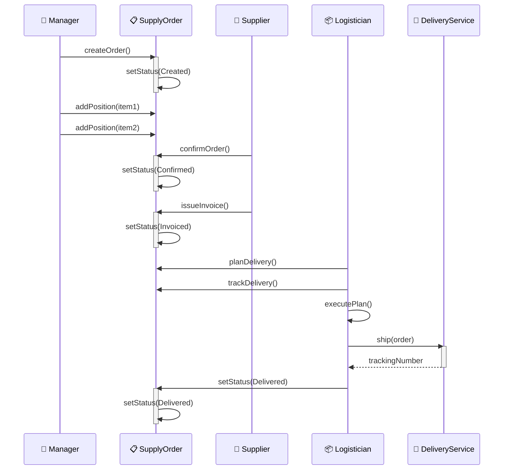

```mermaid
sequenceDiagram
    participant Manager as 👤 Manager
    participant Order as 📋 SupplyOrder
    participant Supplier as 👥 Supplier
    participant Logistician as 📦 Logistician
    participant DeliveryService as 🚚 DeliveryService
    
    Manager ->> Order: createOrder()
    activate Order
    Order ->> Order: setStatus(Created)
    deactivate Order
    
    Manager ->> Order: addPosition(item1)
    Manager ->> Order: addPosition(item2)
    
    Supplier ->> Order: confirmOrder()
    activate Order
    Order ->> Order: setStatus(Confirmed)
    deactivate Order
    
    Supplier ->> Order: issueInvoice()
    activate Order
    Order ->> Order: setStatus(Invoiced)
    deactivate Order
    
    Logistician ->> Order: planDelivery()
    Logistician ->> Order: trackDelivery()
    
    Logistician ->> Logistician: executePlan()
    Logistician ->> DeliveryService: ship(order)
    activate DeliveryService
    DeliveryService -->> Logistician: trackingNumber
    deactivate DeliveryService
    
    Logistician ->> Order: setStatus(Delivered)
    activate Order
    Order ->> Order: setStatus(Delivered)
    deactivate Order
```
