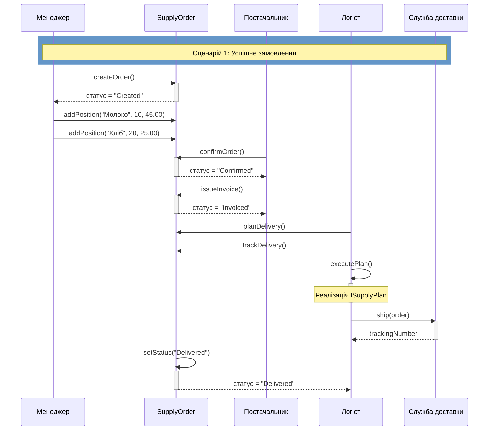

```mermaid
%% Sequence Diagram - Успішне замовлення
sequenceDiagram
    participant Manager as Менеджер
    participant SO as SupplyOrder
    participant Supplier as Постачальник
    participant Logistician as Логіст
    participant DeliveryService as Служба доставки

    rect rgb(100, 150, 200)
        Note over Manager,DeliveryService: Сценарій 1: Успішне замовлення
    end

    Manager->>SO: createOrder()
    activate SO
    SO-->>Manager: статус = "Created"
    deactivate SO

    Manager->>SO: addPosition("Молоко", 10, 45.00)
    Manager->>SO: addPosition("Хліб", 20, 25.00)

    Supplier->>SO: confirmOrder()
    activate SO
    SO-->>Supplier: статус = "Confirmed"
    deactivate SO

    Supplier->>SO: issueInvoice()
    activate SO
    SO-->>Supplier: статус = "Invoiced"
    deactivate SO

    Logistician->>SO: planDelivery()
    Logistician->>SO: trackDelivery()

    Logistician->>Logistician: executePlan()
    activate Logistician
    Note over Logistician: Реалізація ISupplyPlan
    deactivate Logistician

    Logistician->>DeliveryService: ship(order)
    activate DeliveryService
    DeliveryService-->>Logistician: trackingNumber
    deactivate DeliveryService

    SO->>SO: setStatus("Delivered")
    activate SO
    SO-->>Logistician: статус = "Delivered"
    deactivate SO
```
