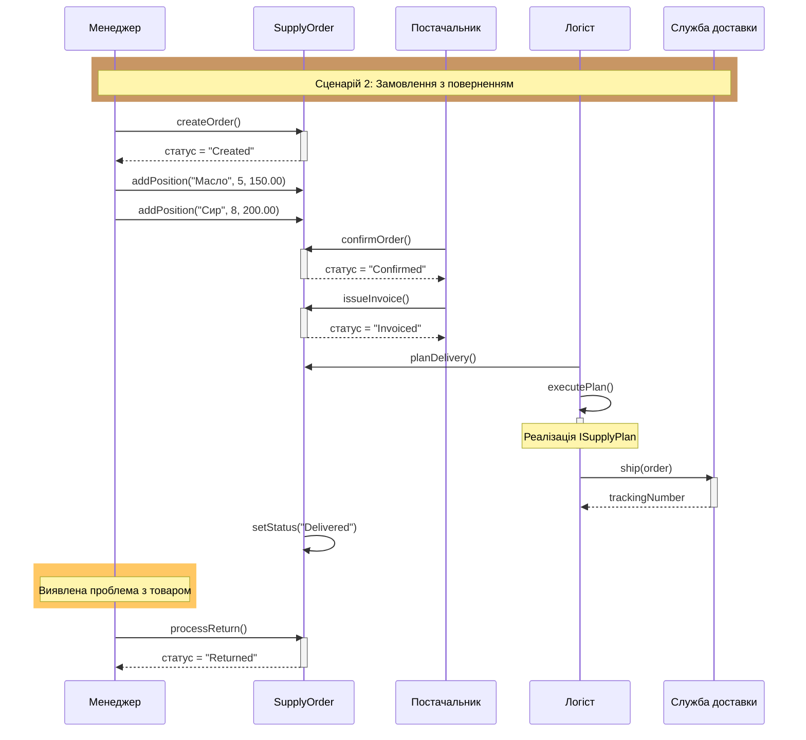

```mermaid
%% Sequence Diagram - Замовлення з поверненням
sequenceDiagram
    participant Manager as Менеджер
    participant SO as SupplyOrder
    participant Supplier as Постачальник
    participant Logistician as Логіст
    participant DeliveryService as Служба доставки

    rect rgb(200, 150, 100)
        Note over Manager,DeliveryService: Сценарій 2: Замовлення з поверненням
    end

    Manager->>SO: createOrder()
    activate SO
    SO-->>Manager: статус = "Created"
    deactivate SO

    Manager->>SO: addPosition("Масло", 5, 150.00)
    Manager->>SO: addPosition("Сир", 8, 200.00)

    Supplier->>SO: confirmOrder()
    activate SO
    SO-->>Supplier: статус = "Confirmed"
    deactivate SO

    Supplier->>SO: issueInvoice()
    activate SO
    SO-->>Supplier: статус = "Invoiced"
    deactivate SO

    Logistician->>SO: planDelivery()
    Logistician->>Logistician: executePlan()
    activate Logistician
    Note over Logistician: Реалізація ISupplyPlan
    deactivate Logistician

    Logistician->>DeliveryService: ship(order)
    activate DeliveryService
    DeliveryService-->>Logistician: trackingNumber
    deactivate DeliveryService

    SO->>SO: setStatus("Delivered")

    rect rgb(255, 200, 100)
        Note over Manager: Виявлена проблема з товаром
    end

    Manager->>SO: processReturn()
    activate SO
    SO-->>Manager: статус = "Returned"
    deactivate SO
```
