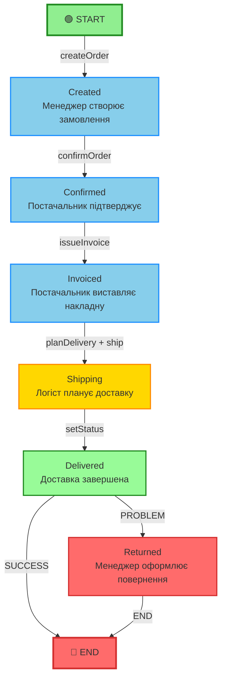

```mermaid
%% State Diagram - Стани замовлення
graph TD
    Start["🟢 START"]
    Created["Created<br/>Менеджер створює замовлення"]
    Confirmed["Confirmed<br/>Постачальник підтверджує"]
    Invoiced["Invoiced<br/>Постачальник виставляє накладну"]
    Shipping["Shipping<br/>Логіст планує доставку"]
    Delivered["Delivered<br/>Доставка завершена"]
    Returned["Returned<br/>Менеджер оформлює повернення"]
    End["🔴 END"]

    Start -->|createOrder| Created
    Created -->|confirmOrder| Confirmed
    Confirmed -->|issueInvoice| Invoiced
    Invoiced -->|planDelivery + ship| Shipping
    Shipping -->|setStatus| Delivered
    Delivered -->|SUCCESS| End
    Delivered -->|PROBLEM| Returned
    Returned -->|END| End

    style Start fill:#90ee90,stroke:#228b22,stroke-width:3px
    style Created fill:#87ceeb,stroke:#1e90ff,stroke-width:2px
    style Confirmed fill:#87ceeb,stroke:#1e90ff,stroke-width:2px
    style Invoiced fill:#87ceeb,stroke:#1e90ff,stroke-width:2px
    style Shipping fill:#ffd700,stroke:#ff8c00,stroke-width:2px
    style Delivered fill:#98fb98,stroke:#228b22,stroke-width:2px
    style Returned fill:#ff6b6b,stroke:#d32f2f,stroke-width:2px
    style End fill:#ff6b6b,stroke:#d32f2f,stroke-width:3px
```
