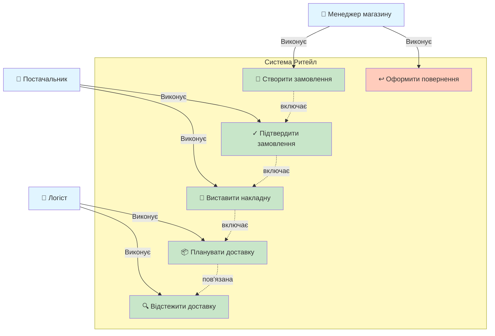

```mermaid
%% Use Case Diagram - Система Ритейл
graph TB
    Manager["👤 Менеджер магазину"]
    Supplier["👤 Постачальник"]
    Logistician["👤 Логіст"]

    subgraph UseCases ["Система Ритейл"]
        UC1["📝 Створити замовлення"]
        UC2["✓ Підтвердити замовлення"]
        UC3["📄 Виставити накладну"]
        UC4["📦 Планувати доставку"]
        UC5["🔍 Відстежити доставку"]
        UC6["↩️  Оформити повернення"]
    end

    Manager -->|Виконує| UC1
    Manager -->|Виконує| UC6
    Supplier -->|Виконує| UC2
    Supplier -->|Виконує| UC3
    Logistician -->|Виконує| UC4
    Logistician -->|Виконує| UC5

    UC1 -.->|включає| UC2
    UC2 -.->|включає| UC3
    UC3 -.->|включає| UC4
    UC4 -.->|пов'язана| UC5

    style Manager fill:#e1f5ff
    style Supplier fill:#e1f5ff
    style Logistician fill:#e1f5ff
    style UseCases fill:#fff9c4
    style UC1 fill:#c8e6c9
    style UC2 fill:#c8e6c9
    style UC3 fill:#c8e6c9
    style UC4 fill:#c8e6c9
    style UC5 fill:#c8e6c9
    style UC6 fill:#ffccbc
```
